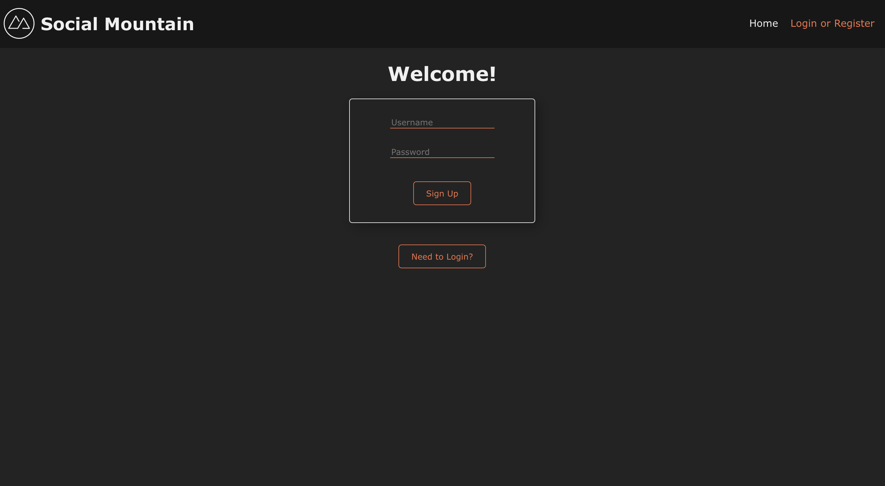
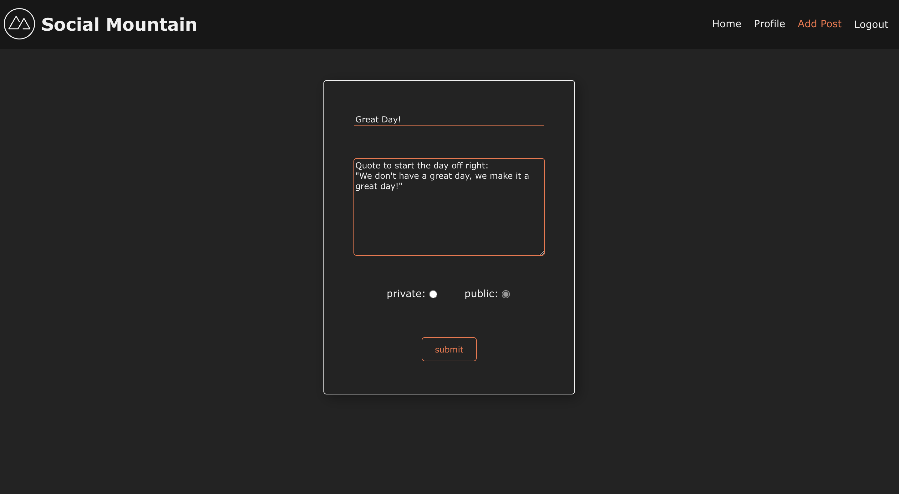
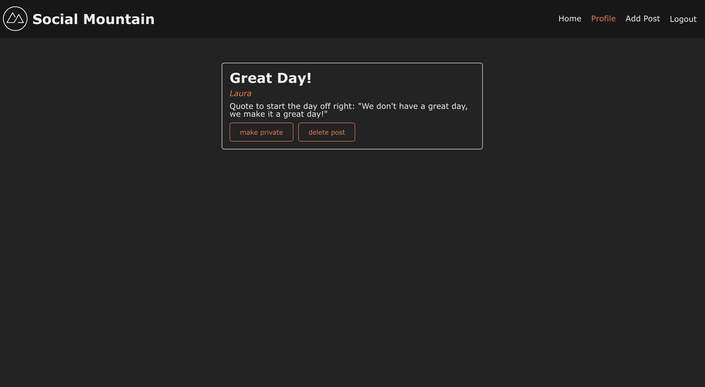
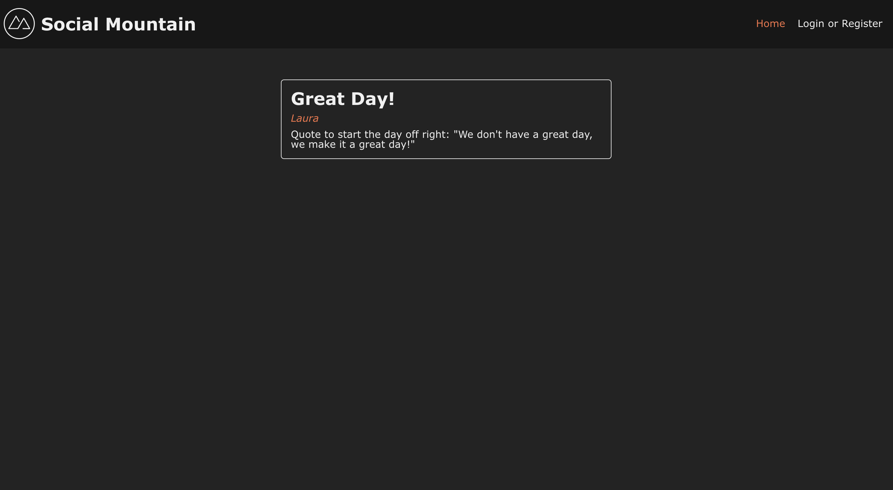

# Social Mountain

Welcome to Social Mountain where users can post anything on their mind and view other's public posts. The app was built using React and bootstrapped with [Create React App](https://github.com/facebook/create-react-app).

## Login
Create a username and password to start posting.

## Post
Once logged in, you can create a post and either make it public or private.

## Profile
Once a post has been submitted, you can view it in your profile. From here, you can edit the visability or delete the post.

## Home
If you're logged out you can still view all the public posts from the Home page.

## How to Use the App
1. Clone or download the project.
2. Navigate to the directory containing the code and run `npm install` to install all the dependencies.
3. Run `npm start` to start the app.
4. Open your browser and navigate to `http://localhost:3000` to use the app.

## Author
Laura Wu
